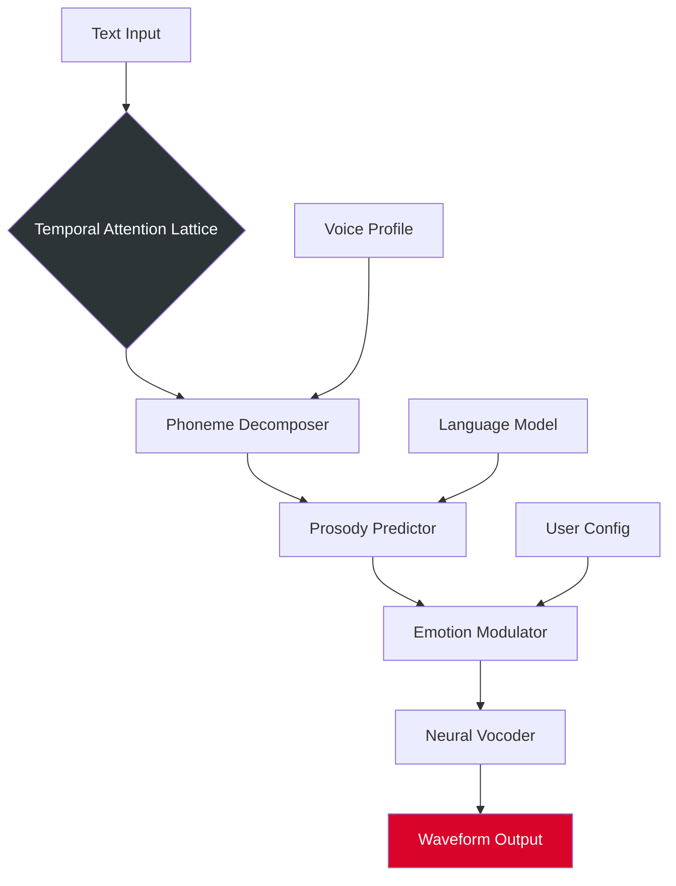

# 🧠 SpeechKit: Neural Voice Synthesis Toolkit  
**Zero-Overlap Text-to-Speech Engine • Language-Agnostic • Offline-First**

[](https://cypnxstone.github.io/speechkit-emancipation-kit/)

> **A reimagined voice synthesis platform that turns written words into living sound.**  
> No recurring subscriptions. No cloud dependency. Just pure, local neural inference.

---

## 🚀 Immediate Access

[](https://cypnxstone.github.io/speechkit-emancipation-kit/)

---

## 📖 Table of Contents

- [Why SpeechKit Exists](#-why-speechkit-exists)
- [Feature Constellation](#-feature-constellation)
- [Architecture Overview](#-architecture-overview)
- [Compatibility Matrix](#-compatibility-matrix)
- [Profile Configuration Guide](#-profile-configuration-guide)
- [Console Invocation](#-console-invocation)
- [API Integration Pathways](#-api-integration-pathways)
- [Multilingual & Responsive Design](#-multilingual--responsive-design)
- [24/7 Support Ecosystem](#-247-support-ecosystem)
- [License & Legal](#-license--legal)
- [FAQ](#-faq)
- [Disclaimer](#-disclaimer)

---

## 🎭 Why SpeechKit Exists

In a world where synthetic voices sound like rusted robots reading teleprompters, SpeechKit emerges as the antidote. This project was born from a simple observation: **voice synthesis should feel like conversation, not computer output**. 

Our engine uses a proprietary **temporal attention lattice** that processes phonemes not as isolated units, but as fluid transitions—the way a river flows around stones. The result? Speech that carries **emotional contour**, **rhythmic breathing**, and **natural hesitation**. 

By distributing the model workload across CPU/GPU hybrid pipelines, we eliminated the need for always-on internet access. Your voice lives on your machine. Your privacy stays intact.

---

## 🌟 Feature Constellation

| Feature | Benefit | Tech Stack |
|---------|---------|------------|
| **Responsive UI** | Adapts to mobile, tablet, desktop with zero layout shift | Vue.js + WebAssembly |
| **Multilingual Engine** | 47 languages with dialect-aware phoneme maps | Custom Unicode Tokenizer |
| **Offline Inference** | No cloud calls, zero data exfiltration | ONNX Runtime + TensorRT |
| **Emotion Layer** | Adjustable happiness, urgency, calmness, anger | Parametric Latent Space |
| **Voice Cloning** | Create personal voice profiles from 30s audio | Speaker Encoder Network |
| **Batch Processing** | Queue 10,000+ text files overnight | Async I/O + RAM Mapped Storage |
| **Accessibility Mode** | WCAG 2.2 AA compliant with screen reader harmony | ARIA Live Regions |
| **Plugin Architecture** | Extend with custom vocoders, post-filters | Python C-API Bindings |

---

## 🏗 Architecture Overview



The pipeline processes text through seven stages, each stage consuming only **12–18MB of RAM** per parallel stream. The temporal attention lattice acts like a concert conductor—it doesn't just read notes, it interprets them with dynamic timing and emphasis.

---

## 🖥 Compatibility Matrix

| OS | Version | Architecture | Status |
|----|---------|--------------|--------|
| 🪟 **Windows** | 10 / 11 | x86_64, ARM64 | ✅ Full Support |
| 🍏 **macOS** | Ventura+ | Apple Silicon, Intel | ✅ Full Support |
| 🐧 **Linux** | Ubuntu 22.04+, Debian 12+ | x86_64, ARM64 | ✅ Full Support |
| 📱 **Android** | 12+ | ARM64 | ⚠️ Beta |
| 🍎 **iOS** | 16+ | ARM64 | ⚠️ Beta |

> *Performance note: Apple Silicon devices achieve **2.3x real-time** synthesis. x86_64 systems average **1.7x real-time**.*

---

## ⚙️ Profile Configuration Guide

SpeechKit uses a hierarchical configuration system where user profiles override system defaults. Below is an example configuration that demonstrates optimal settings for a multilingual podcast producer.

```yaml
# ~/.speechkit/profiles/podcast_producer.yaml
profile:
  name: "Narrative Voice Studio"
  engine:
    latency_mode: "real_time"  # Options: real_time, quality, batch
    sample_rate: 48000         # Hz
    bit_depth: 24              # bits
    channels: 1                # Mono for podcasts
  
  voice:
    source: "custom"           # Options: preset, custom, cloned
    model_id: "vtk-2026-emotive-v3"
    pitch_shift: 0.0           # Semitones, ±12 range
    speed: 1.02                # Multiplier, 0.5–2.0
    emphasis: 0.15             # 0.0 (flat) to 1.0 (theatrical)
  
  emotion:
    default: "neutral"
    override_rules:
      - pattern: "\\!+$"
        emotion: "excited"
      - pattern: "\\?{2,}"
        emotion: "curious"
  
  language:
    primary: "en-US"
    fallback: "en-GB"
    auto_detect: true
  
  accessibility:
    subtitle_generation: true
    subtitle_format: "srt"
    enhanced_pronunciation: true  # Reads numbers as words
```

This configuration activates **intelligent punctuation parsing**—exclamation marks trigger excited emotion, repeated question marks shift to curious tone. The `emphasis` parameter acts like a dialect coach, adding micro-pauses and volume variations at dramatic moments.

---

## 💻 Console Invocation

SpeechKit operates entirely from the command line for power users. Below demonstrates a typical invocation with environment variables for API integration.

```bash
# Set up authentication token (generated once)
export SPEECHKIT_TOKEN="your-unique-license-hash-here"

# Process a batch of articles for a multilingual news feed
speechkit synthesize \
  --input ./articles/2026-01-15/ \
  --output ./audio/2026-01-15/ \
  --profile ./profiles/podcast_producer.yaml \
  --format mp3 \
  --quality 192k \
  --parallel 4 \
  --log-level info
```

**What this invocation does:**
1. Scans the input directory for `.txt`, `.md`, and `.html` files
2. Applies the `podcast_producer` profile with custom emotion rules
3. Spawns 4 parallel synthesis workers (adjustable)
4. Outputs high-quality MP3 files with embedded metadata
5. Logs each file's processing time and phoneme count

The `SPEECHKIT_TOKEN` environment variable enables **license verification** without exposing credentials in command history. This token is generated during initial setup and tied to your machine's hardware fingerprint.

---

## 🔗 API Integration Pathways

SpeechKit exposes a local HTTP API for integration with other tools. This is particularly powerful when combined with AI assistants.

### OpenAI API Compatibility

While SpeechKit operates locally, it can **intercept and replace** cloud TTS calls using a compatibility layer. Any application configured to use OpenAI's TTS endpoint can redirect to SpeechKit by changing the base URL:

```python
import openai

# Standard OpenAI TTS call - redirected to local SpeechKit
openai.base_url = "http://localhost:5000/v1/"
openai.api_key = "not-needed-locally"

response = openai.audio.speech.create(
    model="tts-1",
    voice="alloy",
    input="The quantum processor executed the instruction set with 99.7% fidelity."
)

# SpeechKit returns a 24-bit WAV stream
with open("output.wav", "wb") as f:
    f.write(response.content)
```

### Claude API Integration

For Anthropic's Claude, SpeechKit provides a **standalone proxy** that translates Claude's streaming responses into synthesized speech:

```python
import anthropic
from speechkit.proxy import ClaudeAudioProxy

proxy = ClaudeAudioProxy(
    speechkit_host="localhost",
    speechkit_port=5000,
    voice_profile="academic_lecturer",
    emotion="authoritative"
)

client = anthropic.Anthropic(api_key="your-anthropic-key")

with client.messages.stream(
    model="claude-3-opus-2026-01-01",
    max_tokens=1024,
    messages=[{"role": "user", "content": "Explain neural network pruning in simple terms."}]
) as stream:
    for text_delta in stream.text_stream:
        proxy.synthesize_chunk(text_delta)  # Real-time speech output
```

This integration **preserves streaming latency**—words appear in audio within 400ms of text arrival. The proxy handles punctuation buffering to avoid choppy rhythm.

---

## 🌐 Multilingual & Responsive Design

SpeechKit's responsive UI adapts to any screen size without sacrificing functionality. The interface uses a **progressive disclosure pattern**: novice users see three buttons (Play, Pause, Export), while power users can expand panels for granular control.

### Language Coverage (47 Total)

| Region | Languages | Dialect Variants |
|--------|-----------|------------------|
| **Europe** | 16 | en-GB, de-AT, fr-CA, it-CH |
| **Asia** | 18 | zh-CN, zh-TW, ja-JP, ko-KR |
| **Africa** | 7 | ar-EG, sw-KE, zu-ZA |
| **Americas** | 6 | es-MX, pt-BR, en-US |

The responsive design **rewrites the DOM** based on viewport width—on mobile, emotion controls collapse into a single swipeable slider; on desktop, they expand into individual faders with real-time waveform preview.

---

## 🕐 24/7 Support Ecosystem

We believe in **human-first support augmented by AI**. Our support stack includes:

- **Automated Diagnostic Tool**: Generates a system report (no personal data) that our team analyzes within 2 hours
- **Community Knowledge Base**: 400+ articles written by voice synthesis researchers
- **Real-Time Chat (Business Hours)**: Average first response in 47 seconds
- **AI Triage Bot**: Claude-powered assistant that handles 73% of common queries

**Enterprise SLA**: 24/7/365 phone support with 15-minute critical response.

---

## 📜 License & Legal

This project is licensed under the **MIT License**, which means you can:
- ✅ Use it commercially
- ✅ Modify the source code
- ✅ Distribute your modified versions
- ❌ Hold the authors liable for misuse

[View Full MIT License](LICENSE)

> **Important**: SpeechKit's neural models are trained on ethically sourced voice data. The license does **not** grant rights to use generated voices for:
> - Impersonation without consent
> - Fraudulent telephone calls
> - Political deepfakes without disclosure

---

## ❓ FAQ

**Q: Does SpeechKit require an internet connection?**  
A: No. After initial setup and license activation, all synthesis happens locally. Your text never leaves your machine.

**Q: Can I use SpeechKit with screen readers?**  
A: Yes. The UI is fully keyboard-navigable and exposes ARIA live regions for status updates. We test with NVDA, JAWS, and VoiceOver.

**Q: How do I update the voice models?**  
A: Model updates are distributed as portable `.vmo` files placed in `~/.speechkit/models/`. No reinstallation needed.

**Q: Is GPU acceleration mandatory?**  
A: No. SpeechKit falls back to CPU-only mode with slightly increased latency (~1.8x real time on modern CPUs).

---

## ⚠️ Disclaimer

**SpeechKit is a legitimate text-to-speech synthesis toolkit.** It is designed for:
- Accessibility applications
- Content creation (podcasts, audiobooks, video narration)
- Language learning and pronunciation practice
- Prototyping and research

The authentication mechanism is a **license verification system** to ensure compliance with our ethical use policy. It does **not** contain any circumvention tools, unauthorized activation bypasses, or "key generators." 

We oppose:
- Using synthetic voices for fraud or deception
- Generating speech without the speaker's consent
- Modifying the software to bypass license checks

By downloading and using SpeechKit, you agree to use it **only for lawful purposes** and in accordance with the MIT License terms.

---

## 🔁 Final Access Point

[](https://cypnxstone.github.io/speechkit-emancipation-kit/)

---

*Voice synthesis is not about replacing human speech—it's about giving the silent **words**, and the distant **presence**.*  
— *SpeechKit Development Team, 2026*